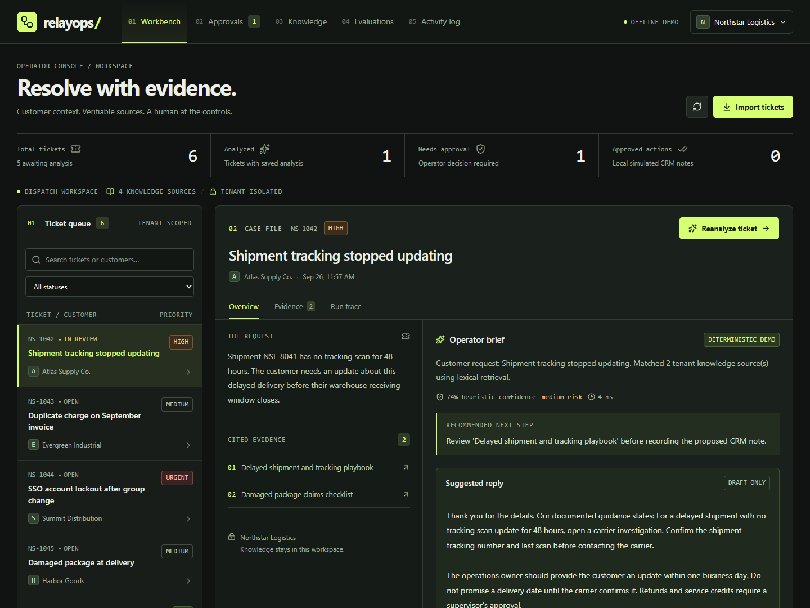
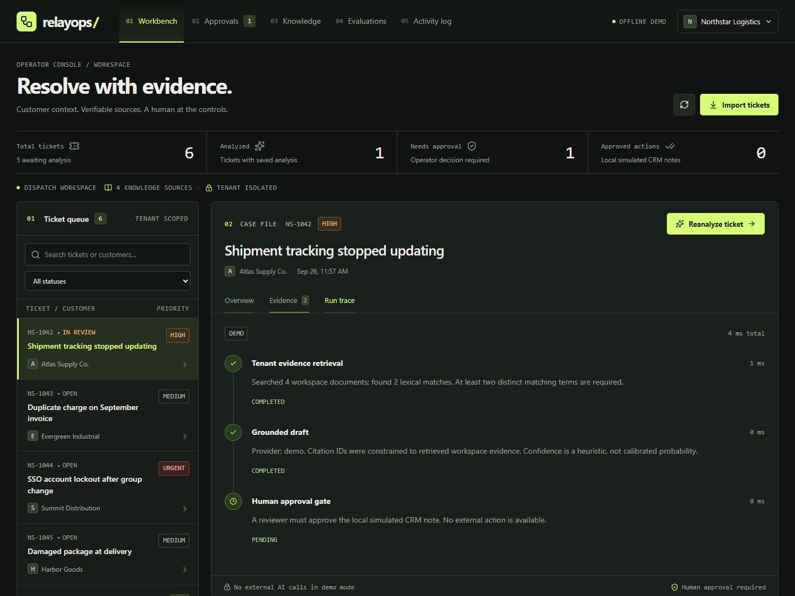
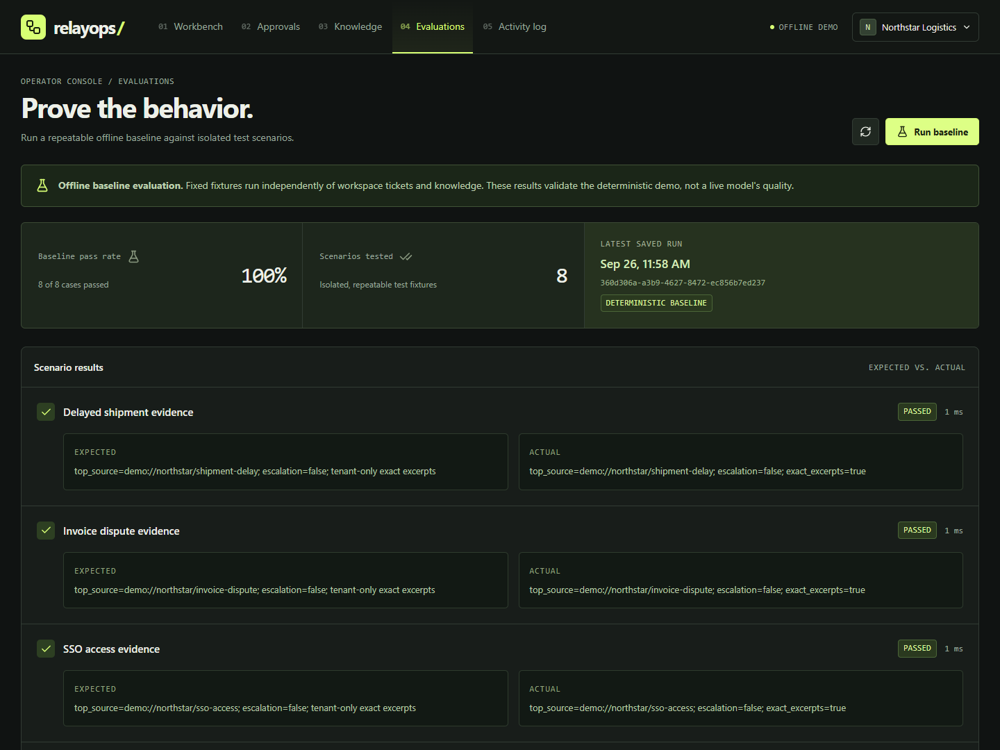
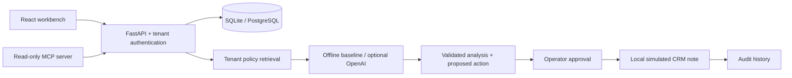

<div align="center">

# RelayOps

### Evidence-backed support operations. A complete FDE portfolio project.

[](https://github.com/muresaijaideepreddy/relayops-fde/actions/workflows/ci.yml)


[](LICENSE)

[Quick start](#quick-start) · [Demo walkthrough](#five-minute-demo) · [Architecture](docs/architecture.md) · [Validation](docs/validation.md) · [Resume bullets](docs/resume-bullets.md)

</div>

RelayOps turns a support ticket into a reviewable, evidence-backed response and a proposed CRM note. An operator reviews the cited policies and execution trace, then approves or rejects the action. A read-only MCP connector lets AI clients inspect the same tenant-scoped information.

This repository models a **fictional customer engagement** from discovery through implementation, evaluation, and handoff. It runs locally with synthetic data and no paid API key. Its CRM connector writes to the local database; it never sends a customer message or changes a real CRM.



<details>
<summary>Explore the interface</summary>





[View the mobile layout](docs/screenshots/mobile.png)

</details>

## What you can do

- **Work a real application flow:** import JSON tickets, triage a queue, generate an analysis, inspect evidence and execution steps, review a draft, and approve or reject a simulated action.
- **Inspect tenant isolation:** switch between Northstar Logistics and Meridian Retail; every business API query is scoped by the authenticated tenant key.
- **Evaluate retrieval and abstention:** run the deterministic baseline suite and inspect individual outcomes. Unknown or unsupported requests escalate instead of pretending evidence exists.
- **Inspect delivery controls:** replay-safe ingestion, transactional approval decisions, a simulated CRM note, structured request logs, audit history, and measured workspace counters.
- **Connect an AI client:** use the [MCP connector](integrations/mcp) to read tickets, existing analyses, evidence, and metrics without exposing write tools.
- **Enable a live model explicitly:** the optional OpenAI Responses adapter validates structured output and citation IDs. Offline demo mode remains the default.

## Skills demonstrated

| Area | Implementation |
| --- | --- |
| Customer delivery | [Discovery brief](docs/customer-discovery.md), scope, proposed pilot criteria, demo and handoff runbook |
| Full-stack engineering | React, TypeScript, Vite, Python, FastAPI, Pydantic, REST/OpenAPI |
| Applied AI | Retrieval-augmented workflow, structured model outputs, evidence validation, abstention, human approval |
| Agent interoperability | MCP v2 stdio server, bounded read-only tools, tenant credential propagation |
| Data and integration | SQLAlchemy, SQLite/PostgreSQL, JSON ingestion, tenant-scoped records, replay-safe writes |
| Reliability and delivery | Pytest, Vitest, offline evaluation, API smoke tests, Docker, GitHub Actions |
| Operational visibility | Per-step timings, request IDs, audit events, measured workflow counters |

The [skill map](docs/skill-map.md) connects these artifacts to current FDE role requirements. Retrieval is a transparent lexical baseline; this project does not claim vector search, an autonomous agent, or measured customer productivity improvements.

## Quick start

### Docker

```sh
git clone https://github.com/muresaijaideepreddy/relayops-fde.git
cd relayops-fde
docker compose up --build
```

Open **http://localhost:8000**. API documentation is at **http://localhost:8000/docs**. The compose file binds to localhost and persists demo data in a named volume.

### Local development

Install Python 3.13, Node.js 24, and pnpm 11.19.0. From the repository root:

```sh
python -m venv .venv
```

Activate the environment: `source .venv/bin/activate` on macOS/Linux, or `.venv\Scripts\Activate.ps1` in PowerShell. Then:

```sh
python -m pip install -r backend/requirements-dev.txt
pnpm --dir frontend install --frozen-lockfile
python scripts/dev.py
```

Open **http://localhost:5173**. No `.env` file is needed for the demo. Configuration is read from process environment variables; `.env.example` documents them. Set those variables in the shell or container that starts the API; the application does not automatically load `.env` files.

If a port is already occupied, choose alternatives: `python scripts/dev.py --api-port 8001 --ui-port 5174`.

The frontend reloads automatically during development. Restart the launcher after editing Python code, or run the separate API command with `--reload` when needed.

For a single-server local build, run `pnpm --dir frontend build`, then run `python -m uvicorn app.main:app --host 127.0.0.1 --port 8000` from `backend/`.

### PostgreSQL

```sh
docker compose -f compose.yaml -f compose.postgres.yaml up --build
```

The same SQLAlchemy application uses PostgreSQL with the Psycopg driver. SQLite is the lowest-friction demonstration option. Schema creation is automatic for this initial demo; versioned migrations are a prerequisite for evolving a real deployment.

## Five-minute demo

1. Open the Northstar workspace. Select the delayed-shipment ticket and run analysis.
2. Read the cited policy excerpts, proposed reply, risk flag, and execution steps. Nothing has been sent.
3. Open Approvals and approve the draft. Inspect the saved simulated CRM result and Audit trail.
4. Run Evaluations. Inspect the baseline cases, including unsupported requests. These results measure the bundled synthetic suite, not live model accuracy.
5. Switch to Meridian Retail. Show that its tickets, documents, approvals and audit history are separate.
6. Import the same JSON ticket batch twice. The second import skips existing external IDs.

For an interview, use the [discussion guide](docs/interview-guide.md) to explain the design choices, limits, and next production steps.

## Architecture at a glance



See [architecture](docs/architecture.md) for the trust boundaries and trade-offs; [the runbook](docs/runbook.md) covers configuration, troubleshooting, and pilot readiness.

## Verification

```sh
# In backend, with the project Python environment active:
python -m pytest -q
python -m app.evaluate

# From the repository root:
pnpm --dir frontend test
pnpm --dir frontend build
python scripts/smoke.py
```

`smoke.py` expects a running offline demo and creates synthetic test records. The CI workflow also exercises the MCP interface, a PostgreSQL service, and the built Docker application. [Validation notes](docs/validation.md) distinguish checks actually run from unverified deployment scenarios.

## Honest scope

**Implemented:** a usable local system, isolated synthetic tenants, lexical evidence retrieval, structured optional live-model integration, approval-controlled local actions, MCP reads, deterministic evaluations, and delivery documentation.

**Before real customer use:** SSO and individual reviewer roles, production migrations and backup/restore testing, rate limits and quotas, data retention policy, external connector credentials and retry/outbox behavior, a held-out customer evaluation set, load testing, and security review. Audit records here are database history, not tamper-proof evidence. Citation validity does not guarantee answer correctness. Live-model quality and real customer impact are not established by offline tests.

## Project layout

```text
backend/             API, domain services, synthetic seed, tests and evaluation
frontend/            React workbench and frontend tests
integrations/mcp/    Read-only MCP server and protocol tests
scripts/             Development launcher and HTTP smoke workflow
docs/                Discovery, architecture, runbook, screenshots and resume guide
.github/workflows/   Automated backend, frontend, MCP, PostgreSQL and Docker checks
```

Released under the [MIT license](LICENSE).
