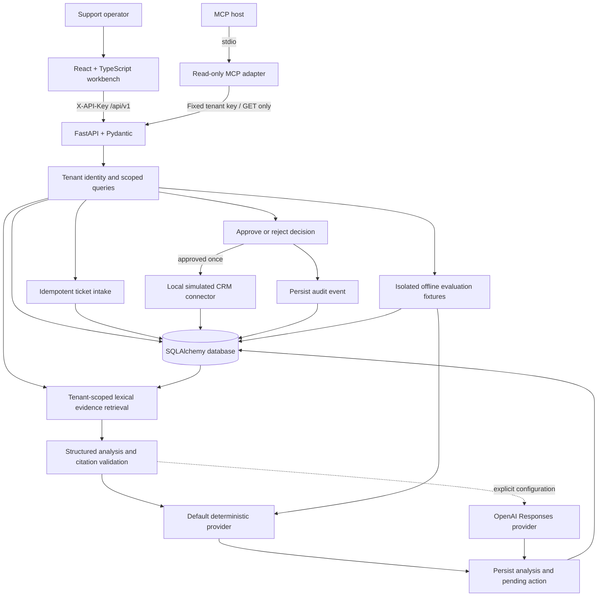

# Architecture and trade-offs

RelayOps implements a small support-operations workflow with synthetic data. It demonstrates a deployable application structure and explicit integration boundaries; it is not a claim of production readiness.

## Runtime and data model

The browser calls relative `/api/v1` routes. Vite proxies development requests to the backend; the backend can serve the compiled frontend for a single-origin build. `/health` is public. Business routes require `X-API-Key`, which resolves a tenant on the server. A client-supplied ticket ID never determines access by itself.

The optional [MCP adapter](../integrations/mcp/README.md) runs as a separate stdio process and exposes four read-only tools: ticket listing, ticket/analysis inspection, literal evidence search, and workspace metrics. It uses the official Python SDK 2.2.0 with validated input schemas and JSON structured results. Its tenant key and API origin are fixed in process configuration; callers cannot supply a key or destination URL through tool arguments. It issues only GET requests, disables redirects, and requires HTTPS for non-local origins. Its literal search is separate from the backend's ranked analysis retrieval. The adapter retrieves data for an MCP host; it does not itself call a model. [Official SDK transport model](https://py.sdk.modelcontextprotocol.io/client/transports/)

Tickets, documents, analyses, actions, audit events, and evaluation results belong to tenants. Ingestion deduplicates on the tenant plus external ticket ID. Analysis stores its evidence and proposed action so a reviewer can inspect the state being approved. The local connector result is persisted with the decision; repeated identical decisions return the existing result, while conflicting decisions return HTTP 409.

SQLite is the default for a low-friction local demonstration. SQLAlchemy accepts a configured PostgreSQL connection through `DATABASE_URL`. PostgreSQL configuration support does not establish that a real PostgreSQL deployment, schema migration strategy, backup process, or concurrent workload has been validated. Refer to [validation](validation.md) for executed environments.

## Analysis boundary

Retrieval is deterministic lexical token overlap with title weighting. It requires at least two distinct content terms and returns at most three exact excerpts. It selects evidence within the authenticated tenant before the provider receives context. It does not use BM25, semantic embeddings, or a vector database. The default provider is deterministic and works offline, making demo behavior reproducible without a model subscription. An explicitly configured OpenAI Responses provider can generate structured analysis using retrieved context. The live provider is not used by the offline evaluation endpoint.

The analysis contract includes a summary, recommended action, draft reply, risk, confidence, citations, escalation flag, provider identity, step trace, and latency. A citation identifies a retrieved document and an excerpt. These fields help an operator assess a recommendation; a citation or confidence value is not independent proof of factual correctness. The live provider uses structured parsing with Pydantic, `store=false`, and validates cited document IDs against retrieved evidence. Refusals, provider errors, or invalid citations return HTTP 502 without persisting an analysis or action. These checks constrain output shape and citation identity; they do not prove the generated claims are entailed by the evidence.

Ticket text and knowledge documents are untrusted content. They may contain incorrect information or instructions that conflict with the workflow. The provider is asked to treat them as data; it cannot directly invoke the CRM connector. Prompt instructions alone are not a complete prompt-injection defense. Server-side access scoping, structured output checks, and human review provide separate boundaries.

## Trust boundaries

| Boundary | Implemented demonstration | Production work still needed |
| --- | --- | --- |
| Browser to API | Tenant selection through server-validated API keys; business routes authenticated | SSO/OIDC, individual identities, role-based permissions, session policy, key rotation, TLS, rate limits |
| MCP host to API | Four read-only handlers, input bounds, fixed origin/key, disabled redirects, safe errors | Dedicated read-only API principal, host trust policy, and operational isolation; the current tenant key also authorizes direct REST writes |
| Tenant to data | Tenant-scoped database access and per-tenant external IDs | Independently reviewed authorization coverage, least-privilege database access, and potentially database row-level security |
| API to provider | Explicit provider configuration; provider key remains server-side | Approved data-processing settings, egress controls, secret manager, retention review, quotas, cost and timeout monitoring |
| Proposal to action | Pending decision, explicit approval/rejection, persisted result and conflict handling | Authenticated approver identity, separation of duties, external connector permissions, transactional outbox and retry policy |
| Application to CRM | Local simulated note only | Real CRM sandbox validation, OAuth, permission scoping, reconciliation, and contractual idempotency semantics |
| Application to operations | Persisted audit events and analysis timing | Centralized logs, trace propagation, alerting, tamper resistance, retention policy, backups and restore drills |

Demo keys are intentionally published credentials for synthetic workspaces. They are unsuitable for an internet-facing private dataset. With `DEMO_MODE=false`, configuration requires custom `TENANT_API_KEYS`, rejects the built-in keys, and enforces a minimum key length of 24 characters. Custom tenants start empty. Tenant selection in the demo does not represent user-level RBAC. Audit records support inspection inside this application; they are not immutable compliance records.

## Deliberate trade-offs

| Choice | Why it fits this first slice | When to change it |
| --- | --- | --- |
| Lexical retrieval | Simple, inspectable, and deterministic for a small policy corpus | Add hybrid/vector retrieval only after a labeled set demonstrates synonym or semantic recall failures |
| SQLite default | One process, local persistence, easy evaluation and reviewer setup | Use PostgreSQL and managed migrations for concurrent deployments and operational ownership |
| Synchronous analysis | Keeps the request lifecycle and trace easy to inspect | Use a queue, job status, cancellation, and backpressure when latency or concurrency needs justify them |
| Deterministic default provider | Reproducible demo and tests without external calls or secret setup | Use live-provider evaluations for model quality; keep the offline suite for application regressions |
| Explicit review step | Gives an operator a visible decision point before a write | Permit only carefully scoped automation after evaluation, authorization, and rollback requirements are met |
| Simulated CRM | Makes the complete workflow testable without third-party credentials | Replace with a sandbox adapter, then validate retries and reconciliation before a real integration |
| Separate MCP process | Exposes useful context to a host while keeping tool arguments and available operations narrow | Add a remote transport only with its authentication, connection, and lifecycle requirements |

There is no vector database, model fine-tuning, distributed agent framework, Kubernetes deployment, Terraform stack, production SSO, or measured customer rollout in this repository. Adding a tool should resolve an observed constraint and include its operating cost.

## Capacity and input limits

The API bounds each document to 20,000 characters, each ticket body to 10,000 characters, and each ingest batch to 100 tickets. These limits bound individual request size; they do not replace tenant quotas, storage limits, rate limiting, or load testing.

The reported `grounded_rate` is an application diagnostic based on stored analyses. It is not a human-graded factuality measurement. `avg_latency_ms` reflects observed application timings in that workspace, not a service-level objective or a production benchmark.
